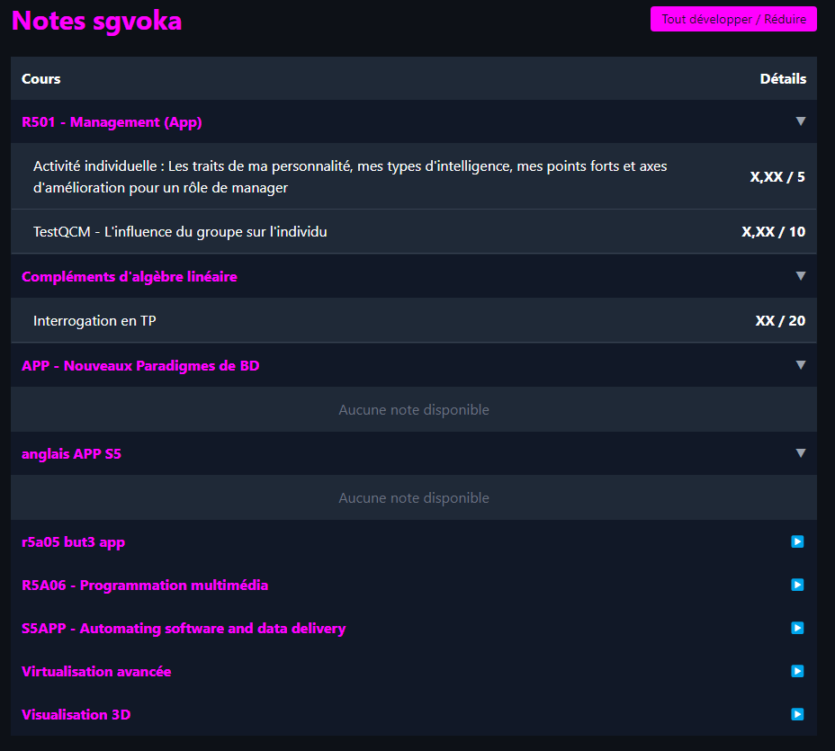

# MoodleGrades
Scripts permettant de générer une page web afin de visualiser ses différentes notes Moodle. \
Pour l'instant, seules les notes de TP5A-APP-A sont disponibles.

## Utilisation :
- Mettre ses ids dans 'id.txt' (IDENTIFIANT A REMPLACER et MOT DE PASSE A REMPLACER ) \
- Lancer le script 'scrapper.py' \
- Attendre la fin d'execution
- Ouvrir dans un navigateur web la page 'notes.html' fraîchement  générées

## Screen :

